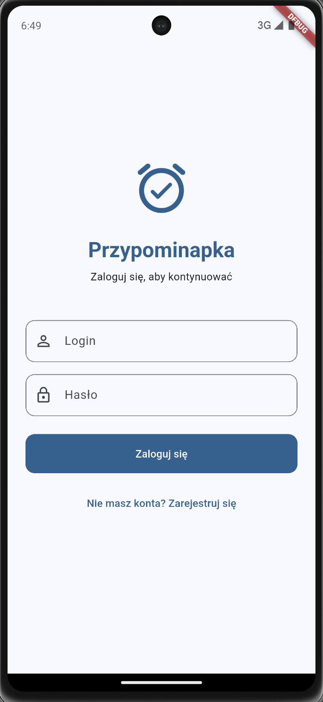
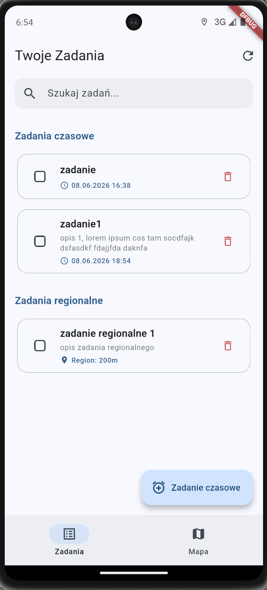
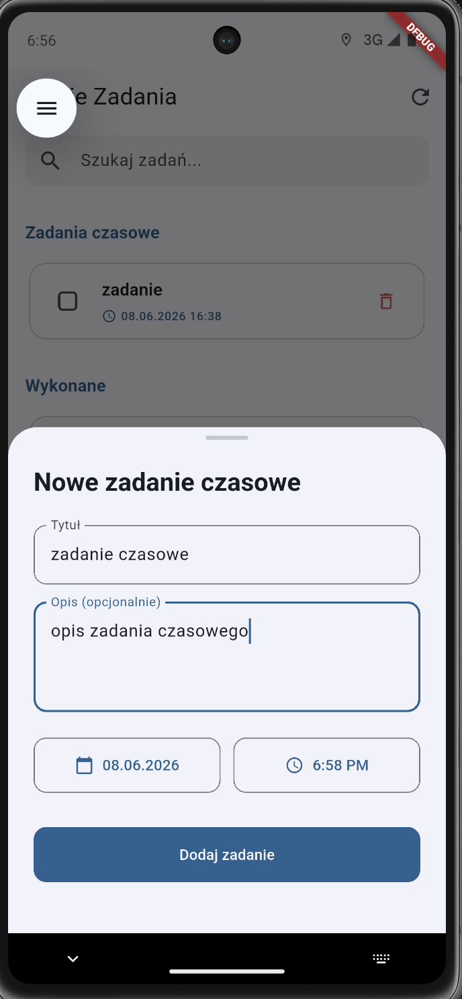
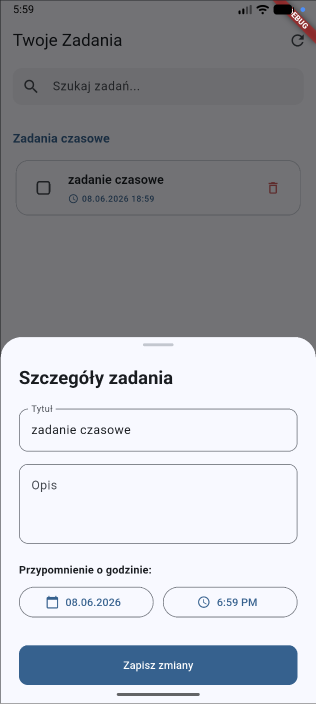
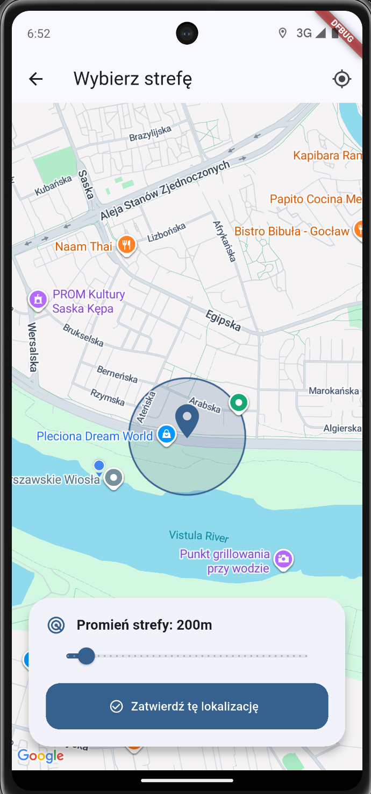
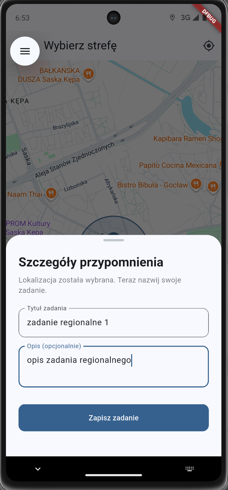
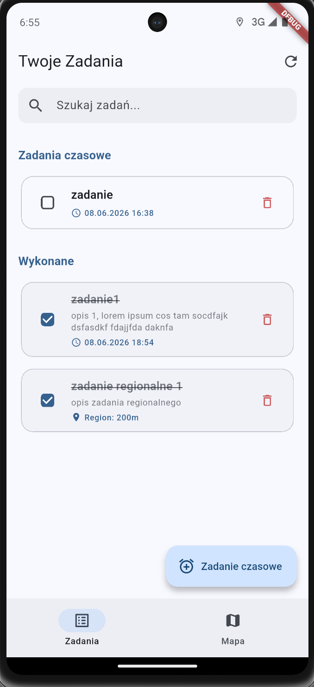
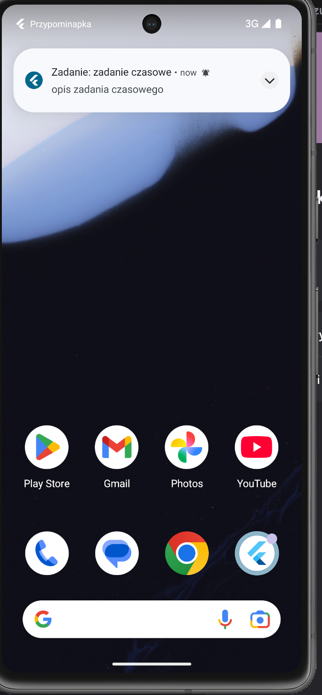
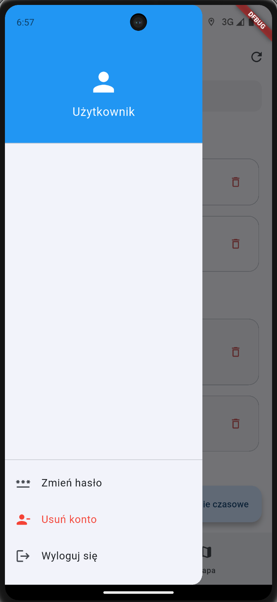

# Przypominapka


---

A full-stack mobile application designed to remind users of tasks based on specific conditions—whether triggered at a scheduled time or upon entering a designated geographic area (geofencing). Built with Flutter for cross-platform mobile delivery and Node.js/TypeScript backend, Przypominapka employs an offline-first architecture with reactive synchronization via Firebase Cloud Messaging to ensure seamless task management across devices.

## Screenshots

<table>
  <tr>
    <td align="center"></td>
    <td align="center"></td>
    <td align="center"></td>
    <td align="center"></td>
    <td align="center"></td>
  </tr>
  <tr>
    <td align="center"><strong>Login Screen</strong></td>
    <td align="center"><strong>App Home Screen</strong></td>
    <td align="center"><strong>Add New Time-Based Task</strong></td>
    <td align="center"><strong>Edit Time-Based Task</strong></td>
    <td align="center"><strong>Add New Location-Based Task</strong></td>
  </tr>
  <tr>
    <td align="center"></td>
    <td align="center"></td>
    <td align="center"></td>
    <td align="center"></td>
    <td align="center"></td> </tr>
  <tr>
    <td align="center"><strong>Add New Location-Based Task</strong></td>
    <td align="center"><strong>Deleting a Task</strong></td>
    <td align="center"><strong>Notification</strong></td>
    <td align="center"><strong>Side menu</strong></td>
    <td></td>
  </tr>
</table>

## Features

- **Location-Based Reminders (Geofencing)** – Trigger tasks automatically when entering or exiting defined geographic areas using native geofencing APIs.
- **Time-Based Reminders** – Schedule reminders for specific times with persistent background handling.
- **Offline-First Architecture** – Full task management capability offline with local reactive database synchronization.
- **Background Sync via Silent Push Notifications** – Real-time synchronization across devices using Firebase Cloud Messaging (FCM) silent data messages.
- **Secure Authentication** – JWT-based token management with encrypted storage.
- **Map-Based Task Visualization** – Interactive Google Maps integration for geolocation-aware task planning and management.
- **Cross-Platform Support** – Native Android and iOS applications built with Flutter.

##  Tech Stack

###  Frontend (Mobile App)

#### Core & Architecture

-  – Main cross-platform framework.
-  – Core programming language.
-  – Reactive state management & DI.
-  – Data models & JSON serialization.
-  – Declarative routing & deep linking.

#### Data & Networking

-  – Advanced HTTP client with interceptors.
-  – Reactive local SQL database.
-  – Encrypted token & sensitive data storage.

#### Native, Location & Notifications

-  – Interactive maps & task visualization.
-  – Foreground active location tracking.
-  – OS-level background geofencing.
-  – Trigger-based native push alerts.

###  Backend (API)

-  – Core programming language.
-  – Web framework.
-  – Schema validation & type inference.
-  – Secure authentication.
-  /  – API documentation.
-  – Low-overhead logging.

###  Database

-  – Relational database.
-  – Serverless Postgres cloud platform.
-  – TypeScript ORM for SQL databases.

###  Cloud Services

-  – Silent push notifications reactive sync.

###  Code Quality & Testing

-  – Native unit & widget testing framework.
-  – Code-generation-free mocking library.
-  – Unit testing framework.
-  – Integration & API endpoint testing.
-  – Code linting and quality control.
-  – Code formatting.

###  DevOps & Infrastructure

-  – Local multi-container environments.
-  – CI/CD automation pipelines.
-  – Production cloud hosting.

## Project Architecture

Przypominapka is built on a multi-layered, decoupled architecture designed to support a robust **Offline-First** paradigm. It consists of a cross-platform Flutter mobile application and a stateless Node.js/TypeScript REST API.

```
+------------------------------------------------------------+
|                          PRESENTATION                      |
|            Flutter UI Widgets (Screens & Components)       |
+------------------------------------------------------------+
                             │  ▲
              State Updates  │  │  Reads Immutable State
                             ▼  │
+------------------------------------------------------------+
|                     VIEWMODEL (RIVERPOD)                   |
|          State Notifiers & Auto-Generated Providers        |
+------------------------------------------------------------+
                             │  ▲
             Invokes Methods │  │  Emits Domain Entities
                             ▼  │
+------------------------------------------------------------+
|                        DOMAIN LAYER                        |
|          Business Logic, Entities & Repository Contracts   |
+------------------------------------------------------------+
                             │  ▲
              Data Requests  │  │  Returns Clean Data Models
                             ▼  │
+------------------------------------------------------------+
|                         DATA LAYER                         |
|    Repository Implementations, DTOs & Sync Coordination    |
+------------------------------------------------------------+
               │                               ▲
      Local    │                               │    Remote
   Operations  ▼                               │  API Requests
+--------------------------+       +-------------------------+
|    LOCAL DATASOURCE      |       |    REMOTE DATASOURCE    |
|  Drift (Reactive SQLite) |       |     Dio (HTTP Client)   |
+--------------------------+       +-------------------------+
```

### Mobile App (Flutter)

The mobile app follows a feature-driven **Clean Architecture** combined with **MVVM**, utilizing **Riverpod** for state management and dependency injection:

- **Presentation Layer (View & ViewModel):** Declarative UI widgets interact with Riverpod providers, which expose immutable states generated via **freezed**.
- **Domain Layer:** Contains pure business logic, core entities, and abstract repository interfaces, remaining entirely framework-independent.
- **Data Layer:** Implements repository contracts and manages data mapping via DTOs across two data sources:
  - _Local Data Source:_ Handles local persistence using **Drift** (reactive SQLite) to provide immediate UI updates via streams.
  - _Remote Data Source:_ Manages API calls using **Dio**, featuring automatic JWT token refresh interceptors.

### Offline-First & Reactive Sync

The application prioritizes local storage to ensure uninterrupted functionality without network connectivity:

- All write, update and delete operations are immediately committed to the local Drift database and flagged with sync metadata (e.g., `isPendingSync`).
- Multi-device synchronization is achieved via Firebase Cloud Messaging (**Silent Push Notifications**).
- A **Background Isolate Handler** intercepts these messages even when the app is closed, fetches delta updates from the backend `/sync` endpoint, and applies them to the local database, instantly triggering reactive UI updates.

### Backend Server (Node.js & TypeScript)

The backend is a stateless, secure REST API built with **Express.js** and TypeScript, focused on strict schema safety:

- **Type-Safe Contract:** Endpoints and routing are explicitly typed using **@ts-rest/express** for compile-time type safety between contracts and controllers.
- **Request Validation:** Every incoming request undergoes strict runtime validation via **Zod** middleware, instantly rejecting malformed data.
- **Business & Database Layer:** Controllers delegate operations to services, while data persistence is handled in a serverless **PostgreSQL (neon.tech)** database via **Drizzle ORM**.
- **Authentication:** Sessions are stateless and secured by automated **JWT** access and refresh token authentication middleware.

##  Frontend Setup (Flutter Mobile App)

To run the Flutter mobile application on Android or iOS devices/emulators:

### 1. Configure Google Maps API Key

Before building the Flutter app, you must add your Google Maps API key to the Android configuration:

```
echo "maps_api_key=YOUR_GOOGLE_MAPS_API_KEY" >> app/android/local.properties
```

Replace YOUR_GOOGLE_MAPS_API_KEY with your actual Google Maps API key.

### 2. Navigate to App Directory

```
cd app
```

### 3. Install Dependencies

```
flutter pub get
```

### 4. Generate Code (Freezed, Riverpod, etc.)

```
flutter pub run build_runner build --delete-conflicting-outputs
```

### 5. Run the App

```
flutter run
```

This command will launch the app on a connected device or running emulator.

##  Backend Setup (Express API Server)

### Prerequisites

Before setting up the project environment, ensure you have the following components installed:

-  **Docker & Docker Compose** _(Recommended for containerized development)_
-  **Node.js v24.x LTS** _(Required for local development)_
-  **PostgreSQL v16+** _(Required for standalone database setups)_

### Quick Start (Docker Compose)

The fastest and most reliable way to spin up the entire backend ecosystem is by using Docker Compose.

### 1. Clone the Repository

```bash
git clone https://github.com/micang7/przypominapka.git
cd przypominapka
```

### 2. Configure Environment Variables

```bash
cp server/.env.example server/.env
```

### 3. Launch Services

```bash
docker compose up -d
```

### 4. Run database migrations

```bash
docker compose exec server npm run migrate
```

### Service Availability

Once the containers are successfully running, the following services will be accessible:

|                                       |                                                                                                                                  |
| ------------------------------------- | -------------------------------------------------------------------------------------------------------------------------------- |
| **API Base URL**                      | `http://localhost:3000/api/v1`                                                                                                   |
| **Interactive API Docs (Swagger UI)** | [http://localhost:3000/api/v1/docs/ui](https://www.google.com/search?q=http://localhost:3000/api/v1/docs/ui)                     |
| **OpenAPI Schema (JSON)**             | [http://localhost:3000/api/v1/docs/openapi.json](https://www.google.com/search?q=http://localhost:3000/api/v1/docs/openapi.json) |
| **Database Instance**                 | `localhost:5433`                                                                                                                 |

## Project Structure

```
przypominapka/
├── .github/workflows/      # Konfiguracja automatyzacji CI/CD (GitHub Actions)
│
├── app/                    # 📱 FRONTEND (Aplikacja Flutter)
│   ├── android/, ios/      # Pliki natywne i konfiguracje dla Androida oraz iOS
│   ├── linux/, macos/      # Pliki natywne dla systemów desktopowych
│   ├── web/, windows/      # Pliki dla przeglądarek i systemu Windows
│   │
│   └── lib/                # Główny kod źródłowy aplikacji (Dart)
│       ├── core/           # Współdzielone usługi i infrastruktura
│       │   ├── api/        # Modele bazowe API
│       │   ├── database/   # Konfiguracja bazy Drift i definicje tabel
│       │   ├── http/       # Zaawansowany klient sieciowy (Dio)
│       │   ├── router/     # Deklaratywna nawigacja (GoRouter)
│       │   └── services/   # Usługi natywne (FCM, Geofencing)
│       │
│       └── features/       # Moduły funkcjonalne (Clean Architecture)
│           ├── auth/       # Logowanie i zarządzanie sesją
│           │   ├── data/           # Repozytoria i źródła danych
│           │   └── presentation/   # Dostawcy stanu (Riverpod) i ekrany UI
│           └── tasks/      # Główny moduł zarządzania zadaniami
│               ├── data/           # DTO, lokalne/zdalne źródła danych
│               ├── domain/         # Abstrakcje, interfejsy repozytoriów (Encje)
│               └── presentation/   # Widżety, ekrany i logika prezentacji
│
└── server/                 # ⚙️ BACKEND (Serwer API Node.js)
    └── src/                # Główny kod źródłowy serwera
        ├── api/            # Definicje schematów DTO (Auth, Sync, Users)
        ├── config/         # Konfiguracja środowiska i stałe
        ├── db/             # Połączenie z bazą, migracje i skrypty bazy danych
        ├── middleware/     # Oprogramowanie pośredniczące (np. walidacja JWT)
        ├── modules/        # Logika biznesowa serwera (End-pointy i serwisy)
        │   ├── auth/       # Uwierzytelnianie
        │   ├── sessions/   # Zarządzanie urządzeniami (deviceId, tokeny FCM)
        │   ├── sync/       # Synchronizacja danych zadań (Offline-First)
        │   └── users/      # Operacje na danych użytkowników
        └── utils/          # Funkcje pomocnicze backendu
```
